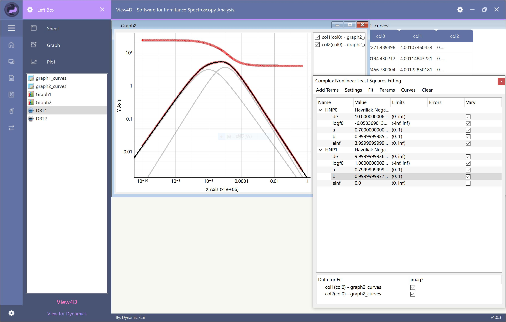
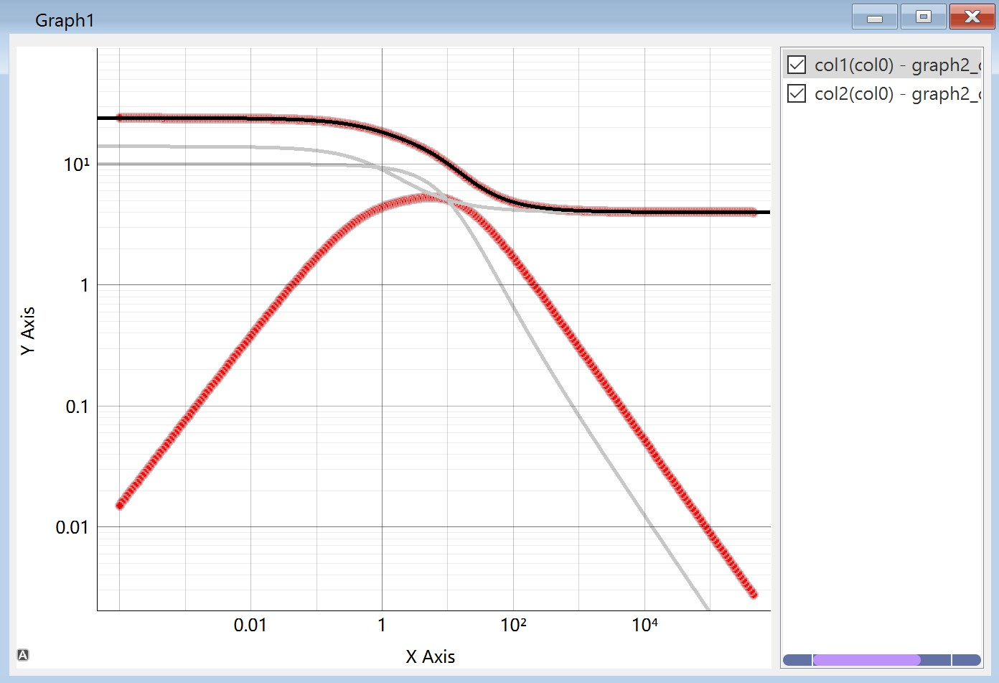
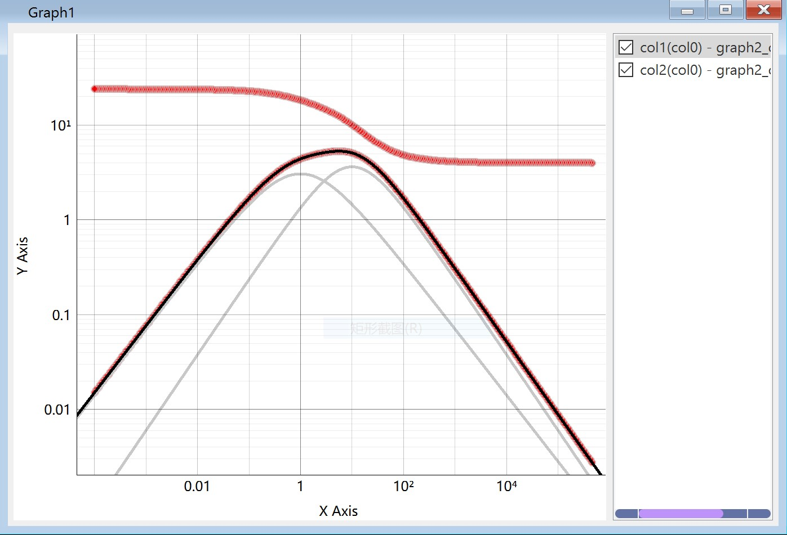
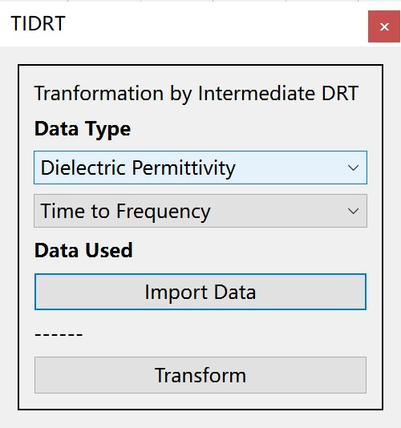
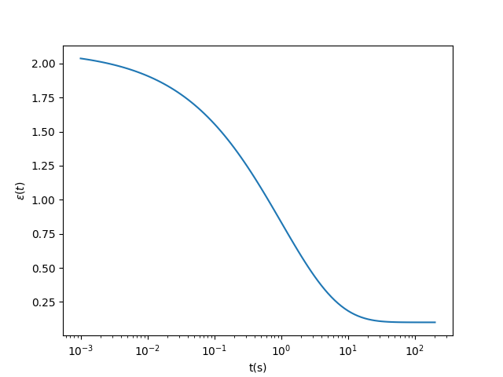
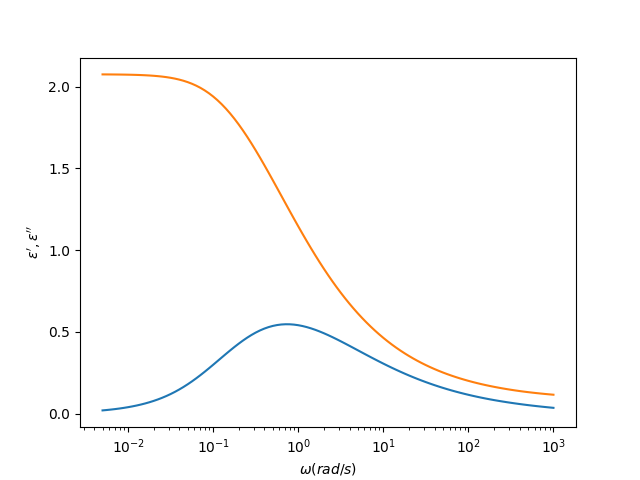
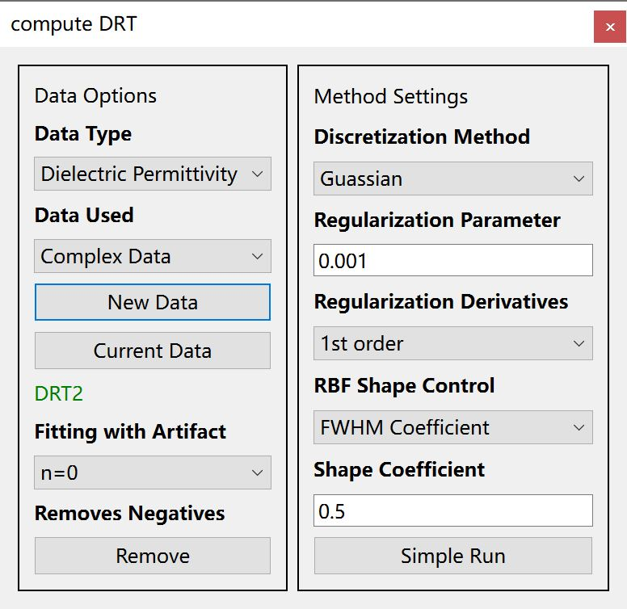
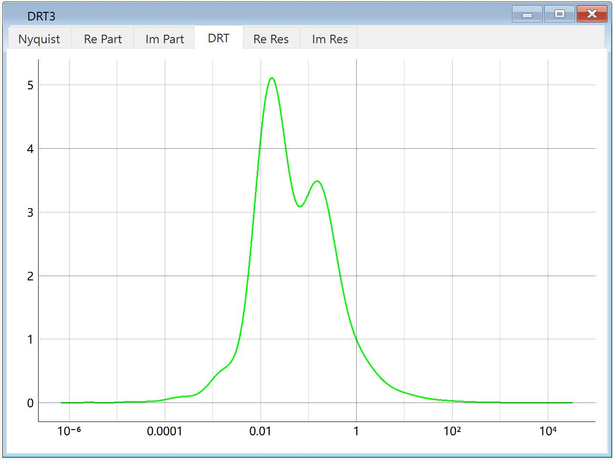

介电阻抗谱（导抗谱）数据分析图形化界面软件

## 功能
View4D软件是一个高度集成化的数据分析/管理软件。用户可以导入多组数据并分别作图，进行多样化的数据处理及拟合操作。

### CNLS模型拟合工具
内置CNLS工具中，可添加多个模型（如HN模型等）叠加对复数形式数据进行拟合，并对拟合参数进行管理。

### 时域/频域数据的高效相互转换工具（以松弛时间分布为媒介）
使用离散傅里叶变换相在对跨越多个数量级的谱图数据进行时域/频域转换上非常笨重。View4D软件内置TIDRT工具可以实现对谱图的时域/频域数据进行高效的点对点转换，转换过程依托于松弛时间分布（DRT）的计算。

KWW方程转换示例：

目前该功能仍在调试中。

### 导抗谱反演计算连续松弛时间分布（DRT）工具
使用岭回归正则化方法求解导抗谱对应的松弛时间分布谱图。

## 环境要求
View4D目前仍在开发测试中，尚无提供exe安装文件。因此，您需要配置python运行环境使用：

- Python 3.11.4
- numpy 1.25.2
- scipy 1.11.1
- lmfit 1.2.2
- cvxopt 1.3.2
- PySide6 6.5.2
- pyqtgraph 0.13.3

